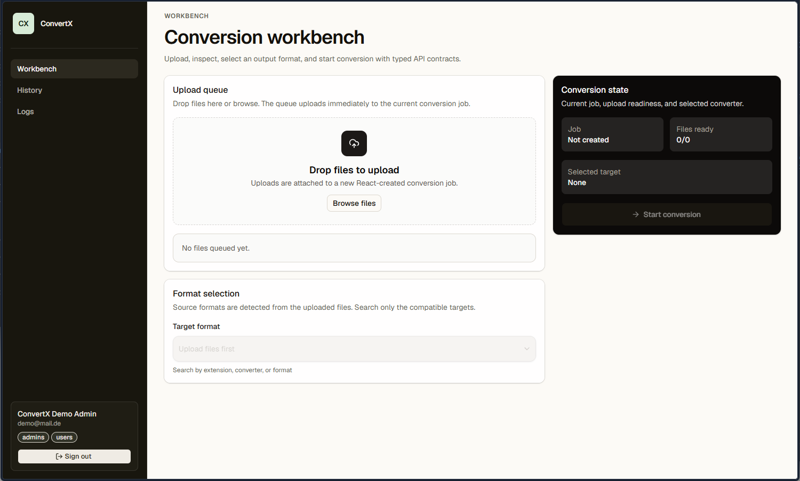

# ConvertX

A self-hosted online file converter. Supports over a thousand different formats. Written with TypeScript, Bun and Elysia.

## Fork status

This repository is a personal ConvertX fork for a homeserver deployment. It keeps the conversion backend, replaces the old server-rendered/local-auth UI with a React TypeScript frontend, and expects authentik forward auth in production. Local ConvertX login, registration, setup, password, and JWT flows have been removed.

## Features

- Convert files to different formats
- Process multiple files at once
- Authentik forward-auth identity
- Admin-only runtime logs

## Converters supported

| Converter                                                       | Use case         | Converts from | Converts to |
| --------------------------------------------------------------- | ---------------- | ------------- | ----------- |
| [Inkscape](https://inkscape.org/)                               | Vector images    | 7             | 17          |
| [libjxl](https://github.com/libjxl/libjxl)                      | JPEG XL          | 11            | 11          |
| [resvg](https://github.com/RazrFalcon/resvg)                    | SVG              | 1             | 1           |
| [Vips](https://github.com/libvips/libvips)                      | Images           | 45            | 23          |
| [libheif](https://github.com/strukturag/libheif)                | HEIF             | 2             | 4           |
| [XeLaTeX](https://tug.org/xetex/)                               | LaTeX            | 1             | 1           |
| [Calibre](https://calibre-ebook.com/)                           | E-books          | 26            | 19          |
| [LibreOffice](https://www.libreoffice.org/)                     | Documents        | 41            | 22          |
| [Dasel](https://github.com/TomWright/dasel)                     | Data Files       | 5             | 4           |
| [Pandoc](https://pandoc.org/)                                   | Documents        | 43            | 65          |
| [msgconvert](https://github.com/mvz/email-outlook-message-perl) | Outlook          | 1             | 1           |
| VCF to CSV                                                      | Contacts         | 1             | 1           |
| [dvisvgm](https://dvisvgm.de/)                                  | Vector images    | 4             | 2           |
| [ImageMagick](https://imagemagick.org/)                         | Images           | 245           | 183         |
| [GraphicsMagick](http://www.graphicsmagick.org/)                | Images           | 167           | 130         |
| [Assimp](https://github.com/assimp/assimp)                      | 3D Assets        | 77            | 23          |
| [FFmpeg](https://ffmpeg.org/)                                   | Video            | ~472          | ~199        |
| [Potrace](https://potrace.sourceforge.net/)                     | Raster to vector | 4             | 11          |
| [VTracer](https://github.com/visioncortex/vtracer)              | Raster to vector | 8             | 1           |
| [Markitdown](https://github.com/microsoft/markitdown)           | Documents        | 6             | 1           |

<!-- many ffmpeg fileformats are duplicates -->

Any missing converter? Open an issue or pull request!

## Deployment

This fork expects authentication to be owned by authentik and Nginx forward auth. ConvertX must not be reachable directly from the public internet; it trusts only `X-authentik-*` headers injected by the trusted reverse proxy.

No public Docker Hub or GitHub Container Registry image is published for this fork. Build the image locally on the homeserver or in CI with `docker compose build`.

```yml
# docker-compose.yml
services:
  convertx:
    build:
      context: .
    container_name: convertx
    restart: unless-stopped
    expose:
      - "3000"
    environment:
      - TZ=Europe/Berlin
      - AUTHENTIK_ADMIN_GROUPS=admins
      - AUTHENTIK_USER_GROUPS=users,admins
      - AUTO_DELETE_EVERY_N_HOURS=24
    volumes:
      - ./data:/app/data
    networks:
      - proxy

networks:
  proxy:
    external: true
```

If host Nginx is outside Docker, bind ConvertX to localhost only:

```yml
ports:
  - "127.0.0.1:3000:3000"
```

For local Docker testing without authentik, use the checked-in `compose.yaml`. It enables `AUTHENTIK_DEV_MODE=true` with a demo admin identity. This mode fails startup when `NODE_ENV=production`.

This authentik schema intentionally does not migrate old local-password users. Back up `data/`, then start with a fresh SQLite database and fresh upload/output folders. If you get unable to open database file run `chown -R $USER:$USER path` on the path you choose.

### Nginx forward auth

Use authentik Proxy Provider forward-auth mode for the `https://convert.homeserver.de` application. Nginx must take the headers returned by the authentik outpost and overwrite any client-provided `X-authentik-*` headers before proxying to ConvertX.

```nginx
location / {
    proxy_pass http://convertx;
    proxy_http_version 1.1;

    proxy_set_header Host $host;
    proxy_set_header X-Forwarded-Proto $scheme;
    proxy_set_header X-Forwarded-For $proxy_add_x_forwarded_for;
    proxy_set_header X-Real-IP $remote_addr;

    auth_request /outpost.goauthentik.io/auth/nginx;
    error_page 401 = @goauthentik_proxy_signin;

    auth_request_set $authentik_username $upstream_http_x_authentik_username;
    auth_request_set $authentik_groups $upstream_http_x_authentik_groups;
    auth_request_set $authentik_entitlements $upstream_http_x_authentik_entitlements;
    auth_request_set $authentik_email $upstream_http_x_authentik_email;
    auth_request_set $authentik_name $upstream_http_x_authentik_name;
    auth_request_set $authentik_uid $upstream_http_x_authentik_uid;

    proxy_set_header X-authentik-username $authentik_username;
    proxy_set_header X-authentik-groups $authentik_groups;
    proxy_set_header X-authentik-entitlements $authentik_entitlements;
    proxy_set_header X-authentik-email $authentik_email;
    proxy_set_header X-authentik-name $authentik_name;
    proxy_set_header X-authentik-uid $authentik_uid;
}

location /outpost.goauthentik.io {
    proxy_pass http://authentik:9000/outpost.goauthentik.io;
    proxy_set_header Host $host;
    proxy_set_header X-Original-URL $scheme://$http_host$request_uri;
    proxy_pass_request_body off;
    proxy_set_header Content-Length "";
}

location @goauthentik_proxy_signin {
    internal;
    return 302 /outpost.goauthentik.io/start?rd=$scheme://$http_host$request_uri;
}
```

### Environment variables

| Name                       | Default             | Description                                                                                                                                                   |
| -------------------------- | ------------------- | ------------------------------------------------------------------------------------------------------------------------------------------------------------- |
| AUTHENTIK_ADMIN_GROUPS     | admins              | Comma-separated authentik groups that can view logs.                                                                                                          |
| AUTHENTIK_USER_GROUPS      | users,admins        | Comma-separated authentik groups allowed to use ConvertX. Set to an empty string to allow any authenticated authentik user.                                   |
| AUTHENTIK_DEV_MODE         | false               | Local-only demo identity mode. Refuses to run when `NODE_ENV=production`.                                                                                     |
| AUTHENTIK_DEV_UID          | local-admin         | Demo identity stable UID.                                                                                                                                     |
| AUTHENTIK_DEV_EMAIL        | demo@mail.de        | Demo identity email.                                                                                                                                          |
| AUTHENTIK_DEV_USERNAME     | demo                | Demo identity username.                                                                                                                                       |
| AUTHENTIK_DEV_NAME         | ConvertX Demo Admin | Demo identity display name.                                                                                                                                   |
| AUTHENTIK_DEV_GROUPS       | admins\|users       | Demo identity authentik groups. Use `users` to test a non-admin user locally.                                                                                 |
| AUTHENTIK_DEV_ENTITLEMENTS |                     | Demo identity authentik entitlements.                                                                                                                         |
| AUTO_DELETE_EVERY_N_HOURS  | 24                  | Checks every n hours for files older then n hours and deletes them, set to 0 to disable.                                                                      |
| WEBROOT                    |                     | The root path. Setting this to `/convert` serves the app on `example.com/convert/`.                                                                           |
| FFMPEG_ARGS                |                     | Arguments to pass to the input file of ffmpeg, e.g. `-hwaccel vaapi`. See https://github.com/C4illin/ConvertX/issues/190 for more info about hw-acceleration. |
| FFMPEG_OUTPUT_ARGS         |                     | Arguments to pass to the output of ffmpeg, e.g. `-preset veryfast`.                                                                                           |
| HIDE_HISTORY               | false               | Hide the history page.                                                                                                                                        |
| MAX_CONVERT_PROCESS        | 0                   | Maximum number of concurrent conversion processes allowed. Set to 0 for unlimited.                                                                            |

### Tutorial

> [!NOTE]
> These are written by other people, and may be outdated, incorrect or wrong.

Tutorial in french: <https://belginux.com/installer-convertx-avec-docker/>

Tutorial in chinese: <https://xzllll.com/24092901/>

Tutorial in polish: <https://www.kreatywnyprogramista.pl/convertx-lokalny-konwerter-plikow>

## Screenshots



## Development

0. Install [Bun](https://bun.sh/) and Git
1. Clone the repository
2. `bun install`
3. `bun run dev`

Pull requests are welcome! See open issues for the list of todos. The ones tagged with "converter request" are quite easy. Help with docs and cleaning up in issues are also very welcome!

Use [conventional commits](https://www.conventionalcommits.org/en/v1.0.0/#summary) for commit messages.

## Contributors

<a href="https://github.com/C4illin/ConvertX/graphs/contributors">
  
</a>


## Star History

<a href="https://github.com/C4illin/ConvertX/stargazers">
 <picture>
   <source media="(prefers-color-scheme: dark)" srcset="https://api.star-history.com/svg?repos=C4illin/ConvertX&type=Date&theme=dark" />
   <source media="(prefers-color-scheme: light)" srcset="https://api.star-history.com/svg?repos=C4illin/ConvertX&type=Date" />
   
 </picture>
</a>
